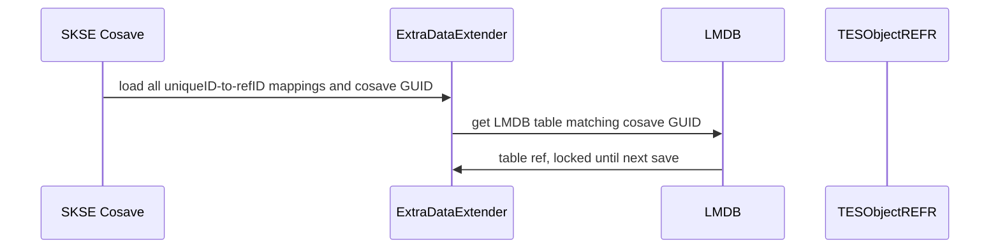
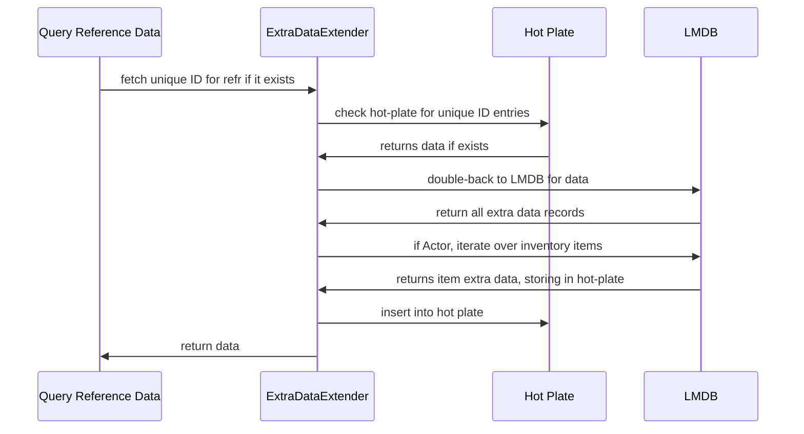
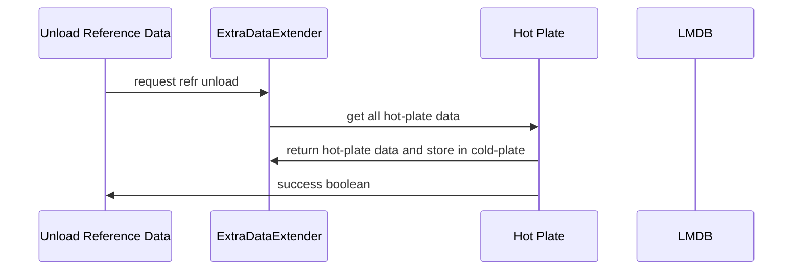
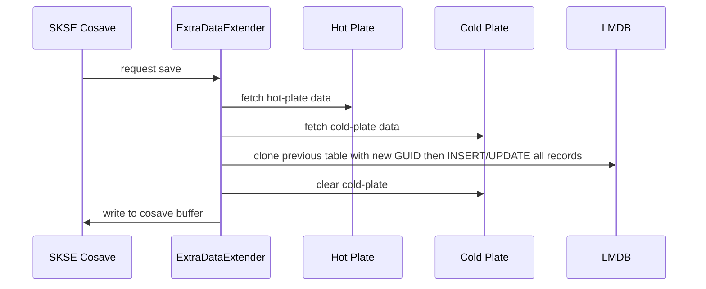

# Extra Data Extender

An SKSE mod for adding extra data to references/items.

## Architecture

- Inventory items are assigned a unique ID that persists in the actual extra data
  - weapons get ExtraHealth
  - armors get ExtraEnchantment
- References are simply tied to a unique ID in the SKSE cosave
- All extra data is stored as a key-value pair of `EDEExtraData::GetType` and a serializable dictionary in LMDB
- When a save is loaded, all UID<->extra-data-dictionary will be stored in memory
- When a reference is loaded/initialized/actually gets work done on it, the extra data for that will be stored on a hot plate for being worked on

> Loading data

> Getting data

> Unloading data

> Saving data

